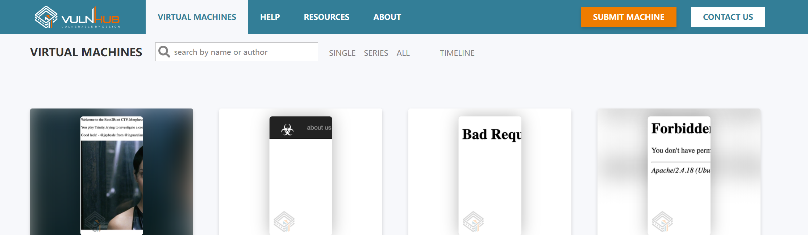

# Vulnhub

> 关于vulnhub靶机获取不到ip [https://blog.csdn.net/weixin_44830645/article/details/123523062](https://blog.csdn.net/weixin_44830645/article/details/123523062)
> 

[Hackademic.RTB1](Hackademic%20RTB1%20ac3725d3b2424a048a94c109ab092a67.md)

[w1r3s.v1.0](w1r3s%20v1%200%20107b61af428980c9b2aedf5fe4af6cbc.md)

[Jarbas-Jenkins](Jarbas-Jenkins%20108b61af4289809d88e9d54cefb9bfa2.md)

[SickOS 1.1](SickOS%201%201%20108b61af428980358472fea6079af9f6.md)

[Prime 1](Prime%201%20109b61af428980b1954fe285b310f901.md)

[**LAMPSecurity: CTF4**](LAMPSecurity%20CTF4%2010ab61af4289802cacb9d2df37dc490d.md)

[**LAMPSecurity: CTF5**](LAMPSecurity%20CTF5%2010ab61af428980f784b9d0cf49d7be9b.md)

[**LAMPSecurity: CTF7**](LAMPSecurity%20CTF7%2010ab61af428980e69e34d1d5d7ca21ec.md)

[pWnOS v2.0](pWnOS%20v2%200%2010bb61af428980bfb86ae689d2bfc518.md)

[**pWnOS: 1.0**](pWnOS%201%200%2010cb61af42898090813eefc6e1080cc6.md)

[**Holynix：v1**](Holynix%EF%BC%9Av1%2010cb61af42898020a53acf30fbf1feee.md)

[**Tr0ll: 1**](Tr0ll%201%2010eb61af4289809bb06ded7ca9c56a21.md)

[**Tr0ll: 2 half**](Tr0ll%202%20half%2010eb61af428980cfbbc2d353f2143734.md)

[DC-1](DC-1%2010fb61af42898058add5c25f3f6026ed.md)

[DC-2](DC-2%2010fb61af428980df9883fd77bd6c683f.md)

[DC-3](DC-3%20110b61af4289807889c8f464657577a5.md)

[DC-4](DC-4%20131b61af42898036ae54eb6719048019.md)

[DC-5](DC-5%20132b61af42898011bc7fdc397f678ac1.md)

[DC-6](DC-6%20132b61af428980e48913c3019831857f.md)

[DC-7](DC-7%20133b61af42898094b878f05e5115ed03.md)

[DC-8](DC-8%20133b61af4289805281b0c5816eb1a9a7.md)

[DC-9](DC-9%20134b61af428980a2ac6bd5570002d65e.md)

[win7-attack](win7-attack%20125b61af428980cb8df4deca2a6f71e1.md)

[Brainpan1](Brainpan1%20129b61af428980e687cafd760962c651.md)

[**billu： b0x**](billu%EF%BC%9A%20b0x%2012db61af4289806fb13fc844fa6c955d.md)

[**Kioptrix: Level 1.2**](Kioptrix%20Level%201%202%2012eb61af428980ffb203f10cdfeb73f7.md)

[**SecTalks：BNE0x03 - Simple**](SecTalks%EF%BC%9ABNE0x03%20-%20Simple%2012fb61af428980a0bfeddd43621c6ad9.md)

[**SecTalks：BNE0x00 - Minotaur**](SecTalks%EF%BC%9ABNE0x00%20-%20Minotaur%2012fb61af428980e397b1ca039ad78cdc.md)

[**Empire: LupinOne**](Empire%20LupinOne%20135b61af428980428b86f0d0e8de9943.md)

[**Empire: Breakout**](Empire%20Breakout%20135b61af428980a4b4e6cda351764b6b.md)

[**DarkHole: 1**](DarkHole%201%20138b61af428980278a44d5b079786d7c.md)

[**DarkHole: 2**](DarkHole%202%20138b61af428980ed85c4ebc7fbf04db6.md)

[**Napping: 1.0.1**](Napping%201%200%201%2013ab61af428980c38812f222dc72a30f.md)

[**Corrosion: 1**](Corrosion%201%2013bb61af428980648414d08c4dbed5a0.md)

[**Corrosion: 2**](Corrosion%202%2013bb61af428980dd8da0f67ea3e9ee8a.md)

[**Chronos: 1**](Chronos%201%2013fb61af42898091a9e1c2f3f9be4688.md)

[**sunset: midnight**](sunset%20midnight%20153b61af42898020a357da9162f4f758.md)

[**sunset: dawn2**](sunset%20dawn2%2015eb61af42898073874ac9428c0d1d82.md)

